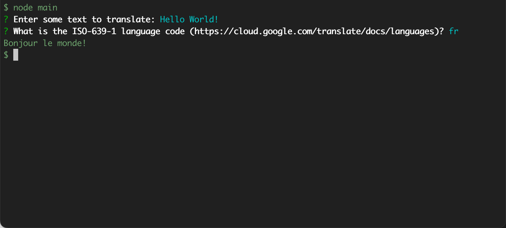

# demo-nodejs-cloud-client

Two demo apps using the Node.js Cloud Client library to access Google Cloud APIs.

### [ex01](./ex01) - CLI app demo

### [ex02](./ex02) - Node.js/Express/Angular demo deployed on Cloud Run

